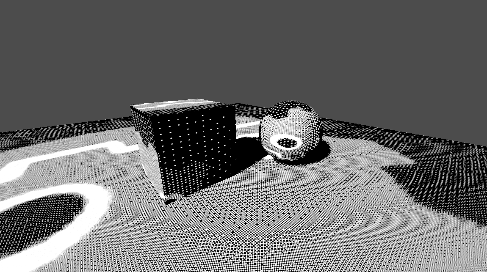

# Surface-Stable Fractal Dithering in Godot
This is an implementation of [runevision's Surface-Stable Fractal Dithering](https://github.com/runevision/Dither3D) in Godot.

I wrote [a blog post](https://tufourn.com/posts/surface-stable-fractal-dithering-in-godot/) on how I implemented the technique.

This repo contains a test scene with a few basic meshes to demonstrate the dithering effect.



The main logic is in `Shaders/Dither3D.gdshaderinc` which is basically the original implementation ported to Godot's GLSL-like shading language.

The 3D dither pattern texture files are available, but I've also included the `CreateDitherTextures.gd` script which you can use to generate them yourself.

Ambient lighting needs to be disabled for the effect to work properly. Because Godot doesn't provide a way to apply shading after all the lights have been applied, I had to use this trick in the `light()` shader.

```glsl
void light() {
    float NoL = clamp(dot(NORMAL, LIGHT), 0.0, 1.0);
	
    // using DIFFUSE_LIGHT as a spare variable to accumulate light
    DIFFUSE_LIGHT += LIGHT_COLOR * ATTENUATION * NoL;

    // calculate dither
    vec2 dx = dFdx(UV);
    vec2 dy = dFdy(UV);
    SPECULAR_LIGHT = get_dither_3d_color(UV, dx, dy, vec4(ALBEDO * DIFFUSE_LIGHT, 1.0)).rgb;

    // cancel contribution of DIFFUSE_LIGHT
    SPECULAR_LIGHT -= DIFFUSE_LIGHT * ALBEDO;
}
```

## Credits
This project is based on [runevision's Surface-Stable Fractal Dithering](https://github.com/runevision/Dither3D). No code was directly used, but the original project is licensed under MPL-2.0.
